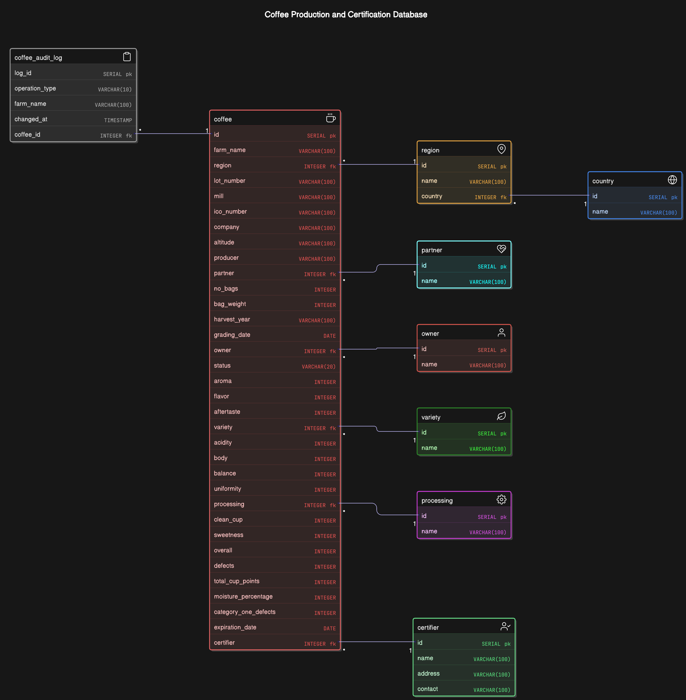

# Formative Database Design <Peer 12>

## About Dataset
CQI maintains a web database that serves as a resource for coffee professionals and enthusiasts who are interested in learning about coffee quality and sustainability. The database includes a range of information on coffee production, processing, and sensory evaluation. It also contains data on coffee genetics, soil types, and other factors that can affect coffee quality.

## Normalization
The database is normalized to the third normal form (3NF). The normalization process is as follows:

1. **First Normal Form (1NF)**
    - Each table has a primary key.
    - Each column contains atomic values.
    - Each column has a unique name.
    - The order of the columns is not important.

2. **Second Normal Form (2NF)**
    - The table is in 1NF.
    - All non-key attributes are fully functional dependent on the primary key.

3. **Third Normal Form (3NF)**
    - The table is in 2NF.
    - There are no columns that are dependent on other non-key columns.
    
